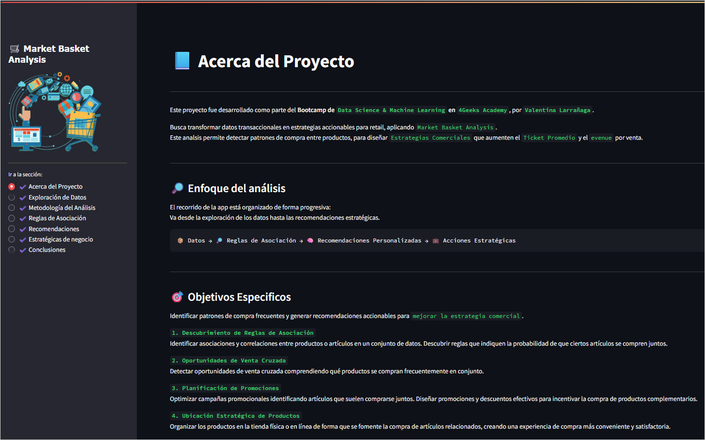
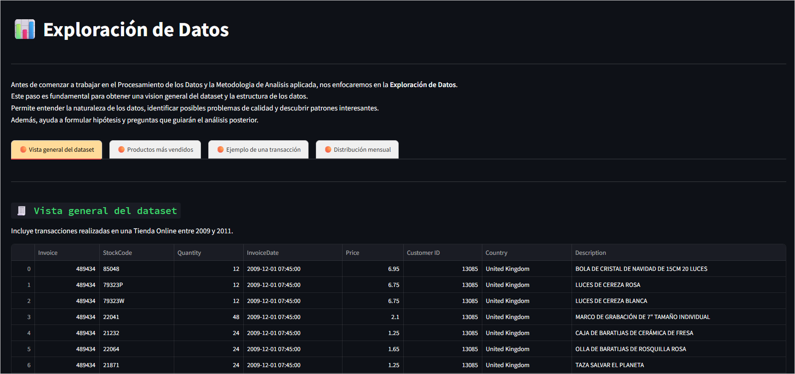
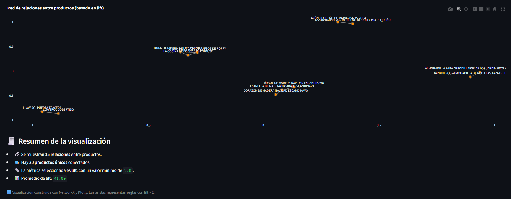
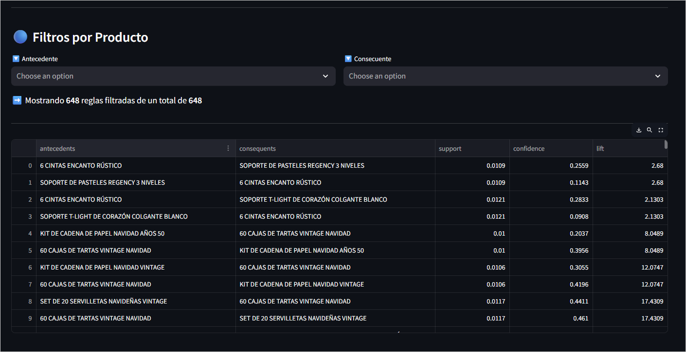
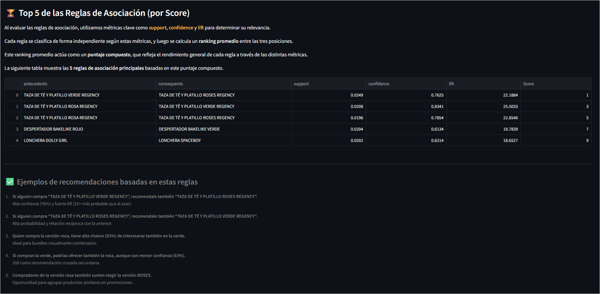
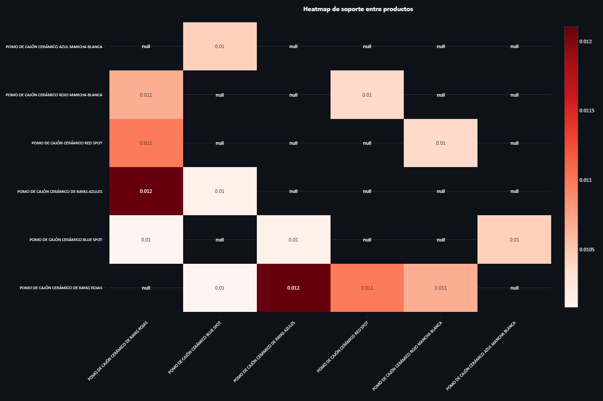
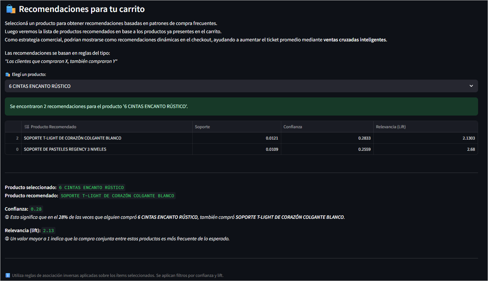
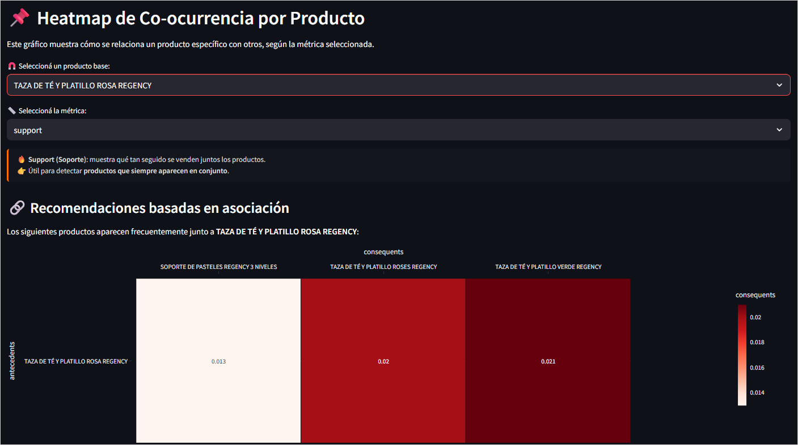
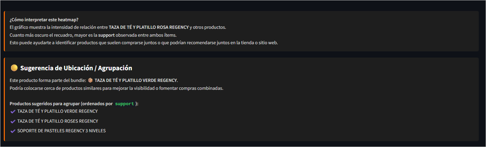

# 🛒 Market Basket Analysis

### Proyecto final — Bootcamp Data Science & Machine Learning (4Geeks Academy)

Desarrollado por: **Valentina Larrañaga**\
App interactiva: [🔗 Ver app en vivo](https://market-basket-analysis-xb0x.onrender.com/)\
Repositorio GitHub: [📁 Ir al repositorio](https://github.com/mvlarra/Final_Project_MBA)

---

## 📘 Resumen del Proyecto

Este proyecto aplica técnicas de Market Basket Analysis para detectar patrones de compra frecuentes y proponer estrategias comerciales accionables en el contexto de retail.

---

## 🎯 Objetivo del proyecto

- Detectar asociaciones entre productos frecuentemente comprados juntos.
- Diseñar recomendaciones personalizadas.
- Proponer acciones comerciales para aumentar el ticket promedio.

---

## 🔎 Metodología aplicada

- Dataset real de transacciones online (UK, 2010–2011)
- Algoritmo: **Apriori** (`mlxtend`)
- Generación de matriz binaria `Factura x Producto`
- Filtros aplicados: soporte ≥ 1%, confianza ≥ 20%, lift ≥ 2

---

## 📊 Exploraciones y Reglas

- Visualización de productos más vendidos, transacciones por mes, ejemplo real de canasta.
- Reglas de asociación exploradas en red, tabla y heatmap.
- Reglas clave: confianza > 70%, lift > 20.

---

### 🖼️ Capturas de la App

#### 🏠 Acerca del Proyecto
>


#### 📊 Exploración de Datos
>

#### 🔗 Reglas de Asociación

##### 🗺️ Red de productos
>

##### 📋 Tabla de reglas generadas
>

##### 🏆 Top 5 reglas por score
>

##### ♨️ Heatmap de asociación
>

#### 🛍 Recomendaciones Personalizadas
>

#### 📌 Heatmap por Producto

##### 🎯 Relación con otros productos
>

##### 📍 Sugerencia de ubicación o agrupación
>


#### 💼 Acciones Estratégicas

#### 📋 Conclusiones y Resultados

---


## 🛍️ Recomendaciones y Acciones Estratégicas

- Recomendaciones personalizadas por producto
- Heatmap para analizar asociaciones por soporte, confianza o lift
- Sugerencias de bundles, promociones cruzadas, rediseño de layout y acciones operativas

---

## 📋 Conclusiones y aprendizajes

- Se logró una app funcional con navegación intuitiva, visualizaciones y propuestas de negocio.
- Se integraron herramientas de ciencia de datos con enfoque práctico para retail.

---

## 🛠️ Instrucciones Técnicas

### 📁 Estructura del Proyecto

```bash
Final_Project_MBA/
│
├── app.py                     # Archivo principal para ejecutar la app Streamlit
├── requirements.txt          # Librerías necesarias
├── devcontainer.json         # Configuración para GitHub Codespaces / Docker
├── /data/processed/          # CSVs con reglas y bundles procesados
├── /sections/                # Código modular por sección (about, metodología, reglas, etc.)
├── /charts/                  # Gráficos reutilizables (heatmap, redes, etc.)
├── /utils/                   # Funciones auxiliares (loaders, visual helpers)
├── /docs/ENTREGA_FINAL.md    # Versión anterior del resumen del proyecto
└── /docs/img/                # Carpeta sugerida para capturas
```

### ⚙️ Requisitos del sistema

- Python 3.11+
- Docker (opcional, recomendado)
- GitHub Codespaces (opcional)
- Navegador web moderno

### 📦 Instalación local

```bash
# 1. Clonar el repositorio
git clone https://github.com/mvlarra/Final_Project_MBA.git
cd Final_Project_MBA

# 2. Crear entorno virtual (opcional)
python -m venv venv
source venv/bin/activate  # En Windows: venv\Scripts\activate

# 3. Instalar dependencias
pip install -r requirements.txt

# 4. Ejecutar la app
streamlit run app.py
```

### 🚀 Despliegue

La app está desplegada en [Render](https://market-basket-analysis-xb0x.onrender.com/) y puede visualizarse sin instalar nada.

### 🧪 Datos utilizados

- Dataset original: **Online Retail Dataset (UCI)**
- Procesado a formato `Factura x Producto`
- Archivos clave:
  - `summary_rules.csv`
  - `bundle_products.csv`
  - `tabular_bundle.csv`

### 🧰 Librerías clave

- `mlxtend`: reglas de asociación (Apriori)
- `pandas`, `numpy`: manipulación de datos
- `plotly`, `networkx`, `matplotlib`: visualizaciones
- `streamlit`: app interactiva

### 📌 Notas para desarrollo

- `app.py` es el punto de entrada de la app (usado por Render)
- Podés modificar secciones editando `/sections/*.py`
- Los datos están en `/data/processed/`

---

## 👤 Autor y Créditos

Desarrollado por [Valentina Larrañaga](https://www.linkedin.com/in/valentinalarra/)\
Bootcamp de Data Science & Machine Learning — 4Geeks Academy

